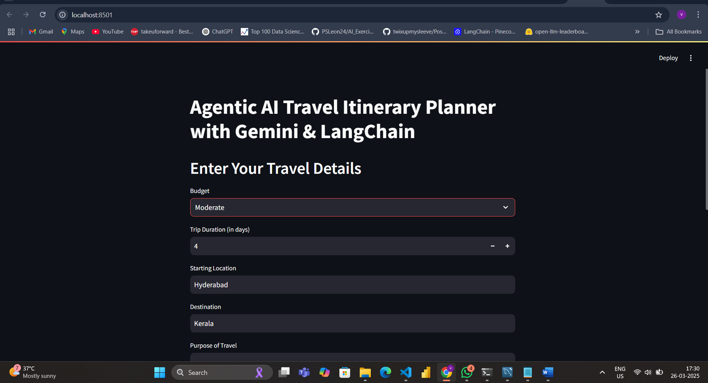
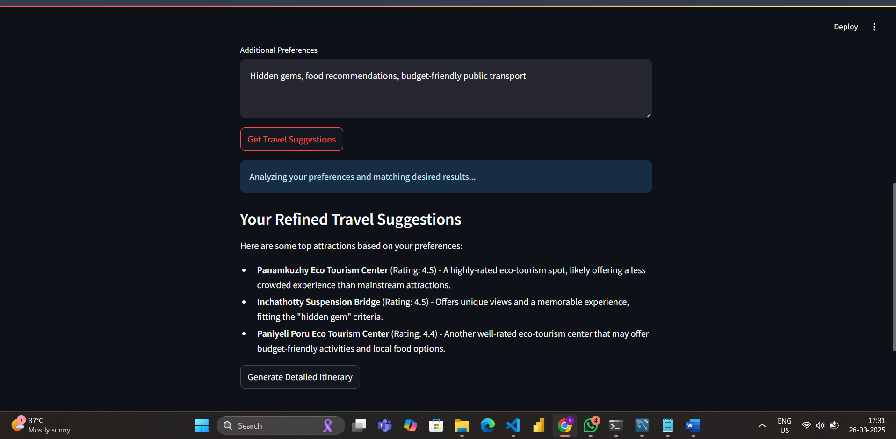
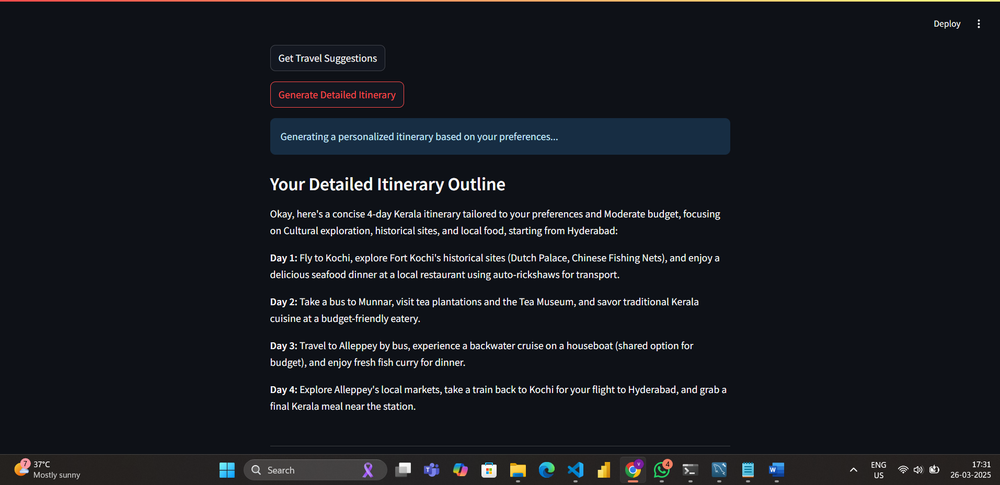

# AI Travel Itinerary Planner

An AI-powered Streamlit app that generates personalized travel suggestions and concise day-by-day itineraries based on your inputs. It leverages a custom Gemini LLM (via LangChain) and the Google Places API to deliver recommendations tailored to your preferences and budget.

## Key Features
- **Dynamic Itinerary Generation:** Create itineraries for 1–30 days with a one-sentence summary per day.
- **Tailored Travel Suggestions:** Get a refined list of top attractions matching your travel style and budget.
- **Secure API Keys:** Loads sensitive credentials from a `.env` file.
- **Interactive UI:** Built with Streamlit for a user-friendly experience.

## Screenshots

